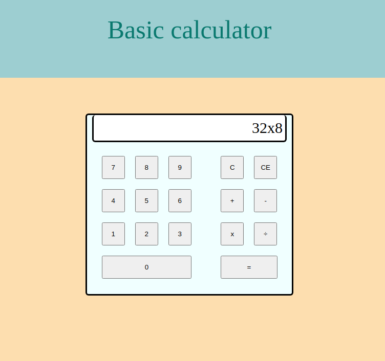

<h1 align="center"> Basic Calculator </h1>

🚀 Calculator created with HTML, CSS and JS.

 

  

💻 Project: Make an on-screen calculator using JavaScript, HTML, and CSS.

https://www.theodinproject.com/lessons/foundations-calculator

---